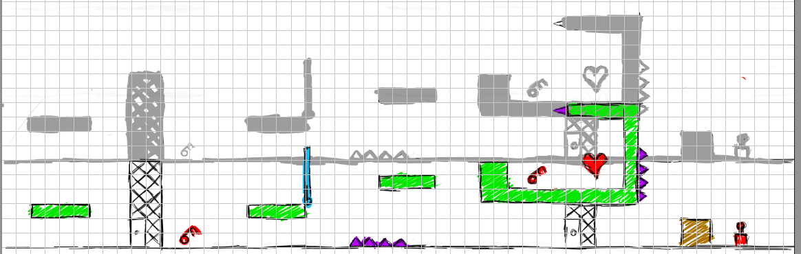
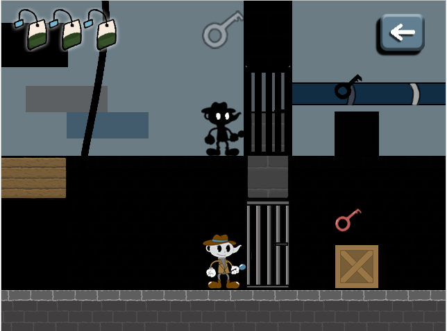
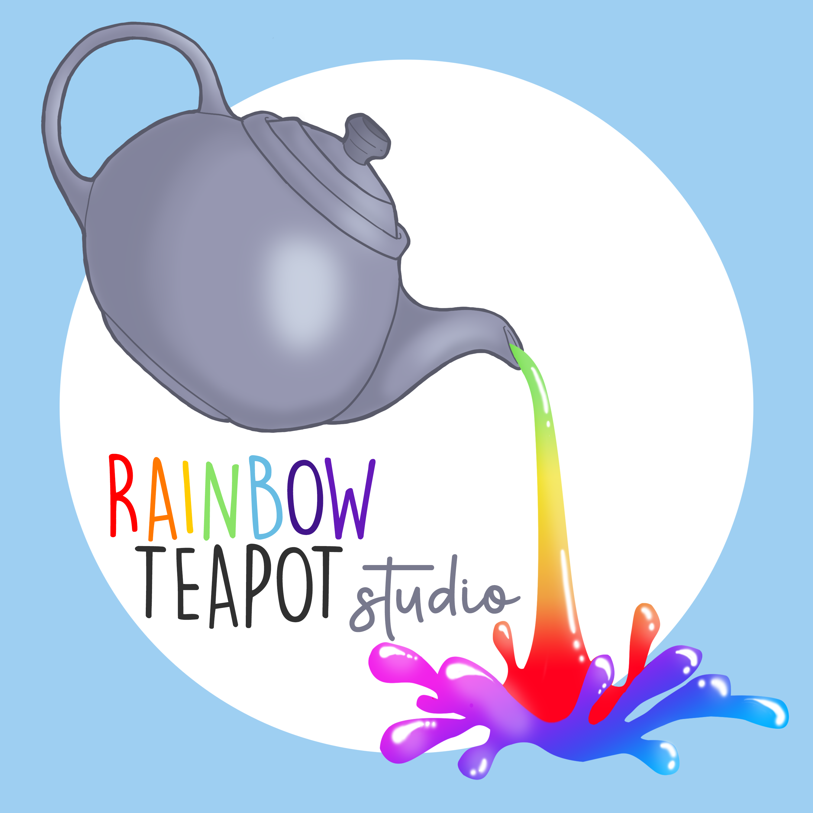

# Detectea Miss Teapot

**Descripción breve del juego:**
 

Hablamos de un videojuego con estética cartoon en dos dimensiones ambientado en Estados Unidos, en la década de 1930, donde nuestra protagonista, Erin, vivirá momentos de tensión y aventura mientras huye de la banda de mafiosos que pretende liquidarla. Erin cometió un error muy grave al enfadar al que no debía, y ahora se ve obligada a recorrer las frías calles de Nueva Orleans mientras da esquinazo a O’Callahan y su banda de matones.
 

Lo que este villano no sabe es que Erin fue bendecida de nacimiento con un poder que le hace un tanto especial: es capaz de comunicarse con su sombra e interactuar con ella. ¿Conseguirá Erin escapar de los suburbios de una metrópolis de 1932 custodiada por la mafia?

**Temática:**

Detectea Miss Teapot es juego de plataformas y puzzles en dos dimensiones, estilo cartoon y ambientado en la primera mitad del siglo XX en EEUU

**Mecánicas del juego:**

Nuestro jugador tendrá la oportunidad de experimentar todas las mecánicas clásicas de un juego de plataformas en dos dimensiones. Sin embargo, contará con el extra de una mecánica especial: podrá cambiar el control del personaje para jugar con su sombra, es decir, se podrá interactuar con la sombra de nuestra protagonista para sortear los obstáculos que nos encontraremos a lo largo de los niveles.

**Ejemplo de nivel:**

A continuación se muestra un ejemplo del nivel, se puede observar que la parte coloreada con bordes negros es el mundo real, mientras que la parte en color gris y sin color, es la parte por donde se mueve la sombra:

Aquí mostramos un ejemplo del juego propio de manera real, tal y como se vería en el juego: 

**Prueba nuestro juego aquí:**

Github-pages: <strong>https://rainbow-teapot.github.io/RainbowTeapotGame/</strong> 

**Desarrollado por Rainbow Teapot Studio. Todos los derechos reservados. 2019**

**Integrantes del equipo de Rainbow Teapot Studios:**

Andrea Rodríguez González- Programador / Artista / Relaciones Públicas

Marcos Agudo Alarcón - Programador / Relaciones Públicas 

Celia  Merino Valladolid- Artista

Juan Antonio Ruiz Ramirez- Ingeniero de Sonido

Carlos Marques González - Game Designer / Level Designer

