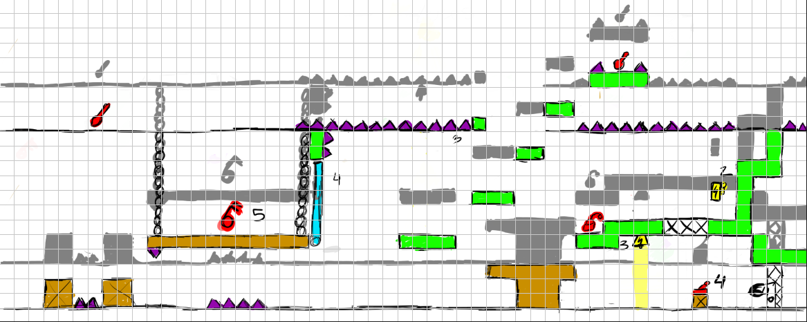
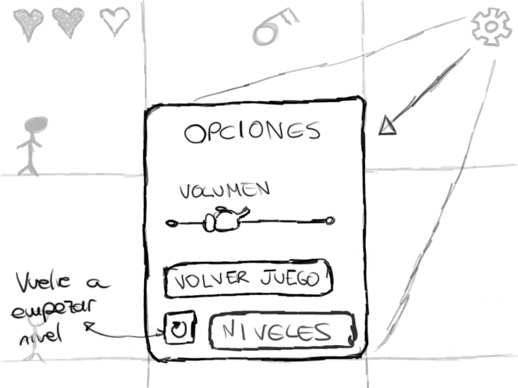

# Detectea Miss Teapot
**Idea General:**

     

**Contexto Histórico:**

Primera mitad del siglo XX. Estados Unidos. La mafia gobierna sobre muchas de las ciudades principales. Algunas de ellas todavía están recuperándose de la devastadora guerra civil del té que sufrió el país a finales del siglo XIX.

Mientras algunos buscaban cualquier resto de valor que sirviera para poder comprar algo de comer, otros ganaban millones extorsionando a los demás para su propio beneficio. Reinaba la Anarquía en todo el país desde el final de la guerra: la gente no se atrevía a presentarse a formar gobierno por miedo a ser asesinados… o algo peor.

Nueva Orleans, una de las ciudades que había pasado por la tangente del ojo del huracán de este conflicto nacional, tenía suficientes recursos como para valerse por sí misma. Aún así, en las calles se veían las consecuencias de la guerra. No había casi gente por las calles; y los que estaban, tenían un aspecto horrible: ropas sucias, caras largas y roñosas… La tragedia estaba a flor de piel.

Aprovechando este bajón a escala nacional, algunas bandas de mafiosos decidieron empezar a realizar negocios ilegales. En esta ciudad, se puso de moda coleccionar aves exóticas de otros países. Algo que solo los más ricos podían disfrutar, ya que este tipo de animales se cotizaban a precios disparados.

El resto del mundo observó de cerca como se desarrolló la guerra, especialmente la CCCP, que aprovechó esto para estar a la cabeza en el desarrollo tecnológico e industrial. Actualmente, era la primera potencia económica del mundo con mucha diferencia. Desde que las dos coreas se volvieron a unir en una república, y china se convirtió en un desierto gigante por el desastre nuclear que sufrió hacían ya 20 años.

La Antártida desapareció por completo debido a un meteorito que cayó haría unos 100 años mas o menos, que hizo que aumentase el nivel del mar en todo el mundo mas o menos 1 metro. Hubo costas en todo el mundo (especialmente África y Oceanía) que quedaron inundadas debido a este fenómeno.

**Descripción breve del juego:**
 

Hablamos de un videojuego con estética cartoon en dos dimensiones ambientado en Estados Unidos, en la década de 1930, donde nuestra protagonista, Erin, vivirá momentos de tensión y aventura mientras huye de la banda de mafiosos que pretende liquidarla. Erin cometió un error muy grave al enfadar al que no debía, y ahora se ve obligada a recorrer las frías calles de Nueva Orleans mientras da esquinazo a O’Callahan y su banda de matones.
 

Lo que este villano no sabe es que Erin fue bendecida de nacimiento con un poder que le hace un tanto especial: es capaz de comunicarse con su sombra e interactuar con ella. ¿Conseguirá Erin escapar de los suburbios de una metrópolis de 1932 custodiada por la mafia?

**Prueba nuestro juego aquí:**

Github-pages: <strong>https://rainbow-teapot.github.io/RainbowTeapotGame/</strong> 

**Mecánicas del juego:**

Nuestro jugador tendrá la oportunidad de experimentar todas las mecánicas clásicas de un juego de plataformas en dos dimensiones. Sin embargo, contará con el extra de una mecánica especial: podrá cambiar el control del personaje para jugar con su sombra, es decir, se podrá interactuar con la sombra de nuestra protagonista para sortear los obstáculos que nos encontraremos a lo largo de los niveles.

¿Cómo funciona esta mecánica?, muy fácil: El jugador verá en todo momento en la pantalla al personaje y a su sombra, junto con el resto del nivel. Cuando el jugador lo considere oportuno, podrá elegir cambiar para controlar a la sombra del personaje. Mientras se controle al personaje, la sombra imitará los movimientos de éste, tal y como haría una sombra común. No obstante, cuando elijamos controlar a la sombra, nuestro personaje real se quedará inmóvil. La sombra solo podrá moverse por los bordes de las sombras que generen los objetos del escenario en concreto. Una vez se esté jugando con la sombra, para volver a jugar con el personaje real, bastará con pulsar de nuevo el botón correspondiente, y la cámara volverá al personaje real.

Existirán momentos en los que dependeremos de lo que haga la sombra para poder avanzar dentro del nivel, mientras que habrá situaciones en las que tendremos que ayudar a la sombra para que pueda avanzar en su parte del escenario. 
No podremos cambiar al modo sombra en cualquier momento, se tiene que dar la situación de que la sombra esté alineada con la sombra de algún objeto a modo de suelo. Si no, no pasará nada. Por ejemplo, mientras el personaje está en el aire por un salto, no podremos cambiar al modo sombra, o viceversa, tendremos que esperar a que llegue al suelo.

Existen ciertos tipos de eventos que la sombra puede realizar y el personaje real no. La sombra puede, aparte de pasar por las paredes con rejilla, recibir daño si le da la luz directa de manera artificial, ya sea con bombillas, lámparas, farolas, etc. Añadiendo que es inmune a las sombras de los pinchos, elemento que sí hace daño a Erin.

La vista principal del juego consiste en un plano frontal, donde se ve el escenario real, con nuestro personaje real, y, encima de éste, el escenario proyectado por la sombra. Todo con vista en 2D.

Los controles están basados en cualquier videojuego de plataformas en dos dimensiones: Podremos controlar al personaje usando las teclas “W, A, S y D” o las flechas de dirección. También se podrá saltar con el personaje.  
Adicionalmente, se usará la tecla “Q” para cambiar entre el modo sombra y el modo normal y la tecla “E” para activar los objetos que sean necesarios en el nivel: una palanca, un interruptor, etc.

No habrá sistema de guardar/cargar partida puesto que se trata de un juego rápido, habrá que pasarse los niveles enteros para poder acceder al siguiente. Lo único que se guardará será el progreso de los niveles, para no tener que empezar desde el principio cada vez que se cargue la página; y la puntuación del jugador dentro del nivel, que dependerá del tiempo que haya tardado en superar el nivel, o del número de veces que haya cambiado entre el modo sombra y el modo normal.

**Interfaces:**

El juego posee una interfaz un tanto sencilla: Para empezar, tenemos el HUD, que estará compuesto básicamente por las tres bolsitas de té, que representan cada una de las vidas de Erin y el indicador de la llave. La vida puede perderse tanto en el modo sombra como el normal, y puede reestablecerse también en ambos modos.

Se nos mostrará un botón en la parte superior derecha de la pantalla, que nos permitirá acceder al menú de opciones dentro del juego. Adicionalmente, y por último, un indicador que nos mostrará el tiempo que llevamos jugando al nivel.

     

     

**Niveles:**

Los niveles serán individuales, y no tendrán una progresión directa, pero sí necesaria, es decir, no se verá una progresión explícita dentro de cada nivel, pero es necesario completar un nivel para poder pasar al siguiente.

Todos los niveles se estructuran de la misma manera, empezamos en el lateral izquierdo de la pantalla al inicio, y para completarlo tendremos que avanzar a la derecha hasta el final del mismo, y coger la tetera dorada para poder finalizarlo. 

Existirán ciertos niveles que requerirán obtener algún coleccionable u objeto para poder superarlo, así como accionar algún mecanismo o eventos similares. También habrá niveles que requerirán completarlos en un tiempo determinado, o que podrás cambiar un número limitado de veces entre el modo sombra y el modo normal (Niveles más avanzados).

El objetivo de cada nivel es huir de los supuestos enemigos que nos persiguen, aunque no se verá explícitamente en el nivel que nos persigue alguien, simplemente se cuenta a modo informativo.

Cuando se juegue el primer nivel, se incluirá un pequeño tutorial para explicar al jugador los controles y las mecánicas del juego, para que no haya lugar a dudas.

En un principio, dentro de cada nivel no habrá ningún enemigo, pero si algún NPC. Podremos interactuar con ellos para que nos cuenten algún suceso curioso de la historia de los personajes principales del juego, o quizá algún consejo para ayudarnos a superar el nivel (Niveles más avanzados).

Dentro de cada nivel, habrá elementos, pertenecientes al entorno, que podrán interactuar con el escenario, así como objetos que hieran a nuestra protagonista o a su propia sombra. Por ejemplo: Podrá haber zonas que sean puntiagudas o tengan pinchos, que puedan dañar al personaje real, o algún objeto que emita luz en el mundo de las sombras, y haga que la sombra se desvanezca en ese punto, haciendo que la sombra “se muera”.

Cada nivel tendrá los mismos efectos de sonido, tanto para andar, saltar, superar un nivel, hablar con un NPC, desbloquear una puerta, accionar una palanca, coger un objeto, caerse al vacío, etc. A parte, se incorporará una música ambiental de fondo que ponga un poco más en situación dentro del juego.

**Nivel 1:**

El nivel uno empezará con un tutorial básico que explicará al jugador como usar los distintos controles que tiene el juego, y cómo funcionan las mecánicas básicas del juego. Está compuesto de 3 pantallas, que nos envuelven en un almacén, dónde estaba teniendo lugar una reunión secreta de O’Callahan, y Erin fue a investigarlo.

Cometió un error, y fue descubierta, así que tiene que huir de ese almacén hasta la calle. Sin embargo, O’Callahan activa las trampas del almacén, que hará que Erin no lo tenga tan fácil:

Esta pantalla corresponde a la primera parte del nivel, es decir, el tutorial. Para superarlo, primero tendremos que usar el modo sombra para que nuestra sombra atraviese la reja y coja la llave de al lado. Una vez pasado, tendrá que correr hasta el final del nivel para activar la palanca que hay detrás de la pared de reja, usando de nuevo el modo sombra. Esta palanca baja el puente levadizo que hay en la mitad del nivel, pudiendo acceder a la llave y al corazón. Con esta llave que coges, abres la puerta de la rejilla de más a la derecha, al lado de la palanca

**Nivel 2:**

Empezamos en la parte de la izquierda del mapa. Tendremos que sortear el agua, que hace daño a Miss Teapot, a través de la plataforma móvil. Después, necesitaremos coger la llave que está en la parte de abajo a la derecha, al lado de la luz, pero primero tendremos que apargar la luz para que la sombra pueda atravesar la puerta sin que se haga daño con la luz, para ello tendremos que apagar la luz con el interruptor que está más a la derecha.

Una vez cojamos la llave, podremos abrir la puerta con Erin y avanzar por la parte de abajo. Después, se podría seguir hacia la siguiente pantalla.

**Nivel 3:**

Empezamos cerca de la baldosa de la izquierda (0). Delante te encuentras una puerta, que solo se abre, a priori, si te quedas encima de la baldosa, por lo tanto, deberás dejar al personaje real ahí, y avanzar con el modo sombra. Tienes que accionar la palanca de electricidad (1) para desactivar la luz del escritorio y la de la plataforma de su derecha. Después tendrás que pulsar el botón del escritorio (2), para desactivar la luz (*) que hay enfocando al botón (3). Por último, hay que pulsar el botón (3), para dejar bajada la pared que estaba sujetando el personaje real desde la baldosa (0). Luego toca volver a modo normal, y llegar hasta el final del nivel.

**Progesión del Juego:**

     

**(1) Inicio de Juego:**

El juego empezará en la pantalla de inicio de juego(1), la cual tendrá un botón “Empezar” que nos llevará al menú principal. A parte de este botón, se verá un fondo con la temática del juego, el título del propio juego y algún otro detalle más que se pensará más adelante.

     

Al pulsar el botón empezar, nos llevará al menú principal del juego (2), donde tendremos tres botones principales: “Jugar”, que nos llevará al selector de niveles del juego; “Opciones”, que nos permitirá acceder a las opciones y configuraciones que tendrá nuestro juego; y créditos, que nos llevará a la pantalla de créditos.

A los laterales de los botones principales tendremos dos imágenes de Erin, una suya(derecha) y una de su sombra(izquierda), orientadas, ambas, hacia los botones. El título del juego aparecerá en grande encima de los botones y, por último, habrá un fondo de estilo parallax scrolling con temática parecida a la de la pantalla de Inicio de Juego(1)

Todo esto irá acompañado de una música de fondo.

**(2) Menú principal:**

     

Si pulsamos en el Menú Principal (2) el botón de “Créditos”, nos mostrará una pantalla con el listado de los desarrolladores del videojuego(3), así como los roles que han desempeñado cada uno de los mismos. Tan solo contendrá un botón en forma de fecha en la esquina superior izquierda.

Irá también acompañado de una música de fondo, distinta a la de otras pantalla que nos volverá al Menú Principal (2)

**(3) Créditos:**

     

Si pulsamos en el Menú Principal (2) el botón de “Opciones” nos llevará a la pantalla de Opciones(4), desde la cual podremos acceder a todos los elementos que podremos configurar dentro del juego. Habrá una pantalla cuadrada donde estarán recogidas todas las opciones en el centro de la pantalla: Podremos controlar el volumen general del juego, en una escala del 1 al 10; podremos cambiar el idioma del juego (de momento solo inglés y español) y activar y desactivar los efectos de sonido y la música.

Esta pantalla compartirá el fondo con el menú principal, y poseerá una flecha en la esquina superior izquierda de la pantalla que nos retornará al menú principal.

**(4) Opciones:**

     

Si pulsamos en el Menú Principal (2) el botón de “Jugar” nos llevará a la pantalla de Selector de Niveles (5). Esta pantalla nos muestra todos los niveles que están disponibles en el juego en esa versión. Cada uno de los niveles estará representado por un botón con el nombre del nivel. Si pulsamos sobre uno de los niveles accederemos al mini-menú de ese nivel en concreto (5.1).

Debajo y encima del botón de cada nivel estarán Erin y su sombra, respectivamente. Cuando seleccionemos otro nivel, ambas se moverán por las líneas dibujadas (rojo y verde) hasta que lleguen al nivel que hemos seleccionado. La línea de puntos es para indicar la progresión que tendrán los niveles.

Desde un primer momento, solo estará disponible el nivel 1, por ende, los demás niveles estarán bloqueados y se verán en blanco y negro hasta que se desbloqueen. En el momento en el que se desbloquee un nivel, po En la esquina superior izquierda aparece una flecha que nos llevará a la pantalla de Menú Principal (2).

**(5) Selector de niveles:**

     

**(5.1) Submenú selector de niveles:**

A la hora de clickar en cualquiera de los niveles que estén disponibles, nos aparecerá un submenú (5.1) que nos mostrará el título del nivel que vamos a jugar, el ranking de puntuación de dicho nivel, mostrando las 3 mejores puntuaciones que se han hecho en ese nivel. Debajo nos aparecerán dos botones, uno más grande, situado a la derecha, que nos llevará a jugar el nivel, y otro botón más pequeño, situado a la izquierda, que nos permitirá quitar este submenú y volver al selector de niveles (5). Adicionalmente, aparecerá miss teapot a la derecha del menú, y a la izquierda, su sombra. Ambas estarán enfrentadas (en simetría).

     

**(6) In-Game:**

Si presionamos en el submenú del nivel (5.1) el botón de “Jugar”, nos llevará a la pantalla del propio nivel (6). En la pantalla del nivel tendremos lo que es el HUD, que nos mostrará la vida que tenemos actualmente en la esquina superior izquierda de la pantalla. En la parte central de la zona superior aparecerá un dibujo de una llave, siempre y cuando hayamos recogido alguna y no la hayamos usado. Por último, tendremos un botón con en la parte superior derecha de la pantalla que nos permitirá acceder al menú de opciones dentro de la partida (6.1).

     

**(6.1) Opciones In-Game:**

Una vez accedamos al menú de opciones dentro de la partida, nos aparecerá un mini menú de opciones (6.1) donde podremos configurar distintos aspectos: primero tendremos una barra de nivel de volumen con niveles del 0 al 1; luego tendremos dos botones, el primero nos permite retornar la partida, y el segundo nos permite volver al Selector de Niveles (5).

     

**(7)Fin del Juego:**

Una vez nos pasemos el nivel en cuestión, tendremos que coger una tetera dorada, la cual solo podrá coger Erin en su forma real, nos llevará a la pantalla de Fin de Juego (7), donde nos aparecerá un título felicitándonos por habernos pasado el nivel (Generalmente pondrá enhorabuena). Abajo nos saldrá el ranking actualizado tras la última jugada que hayas realizado al nivel. Por el resto, será igual que el ranking del submenú de selector de niveles(5.1)

     

**Objetos / Coleccionables:**

 **Llave Simple:** Una llave de un único uso dentro del mismo nivel que nos permite abrir una puerta que esté cerrada.

     

 **Bolsita de té:** Representa cada una de las vidas que tiene Erin. Cuando cogemos una en el escenario, se nos reestablece una vida. Cada vez Erin recibe daño, pierde una de las vidas.

     

 **Palanca:** Objeto que aparece dentro de los niveles para poder mover algún puente u obstáculo.

     
     

 **Interruptor:** Nos permite interactuar con las luces que hay en determinados niveles. Solo afectará a las luces que tienen el mismo símbolo que el propio interruptor.

     
     

 **Tetera dorada:** Nos indica el final del nivel que estamos jugando. Cuando se coge, se acaba el nivel en cuestión. Solo puede cogerla Erin, y no su sombra.

     

**Cucharilla dorada:** Moneda dentro del juego. Se obtendrán en los niveles y con ellas podremos comprar más niveles, o niveles exclusivos.

     

**Personajes:**

 **Erin “Miss Teapot” Jameson:** Nuestra protagonista. Nació en uno de los barrios más pobres de Nueva Orleans, donde vivía con su madrastra. Su padre falleció siendo ella pequeña, y de su madre biológica no se sabe nada. Una intrépida ornitóloga, amante de los atardeceres al aire libre y del campo. Dedica su vida al cuidado de las aves: posee dos reservas naturales donde cuida a las aves en peligro de extinción, y a aquellas que no tengan hogar o estén enfermas. Ganó mucho dinero gracias a un libro que escribió unos años atrás, que fue Best-seller, con más de 7 ediciones, sobre cómo estudiar e investigar cada uno de los tipos de aves rapaces que existen en el mundo.

Desde que tiene uso de razón, ha sido consciente de que tenía un poder que la hacía distinto del resto. Sin embargo, no fue hasta que tenía 12 años, cuando se dio cuenta de que podía controlarlo perfectamente, y cambiar entre su sombra y ella cuando quisiera.

Un día descubrió que había una banda de mafiosos que se dedicaba al contrabando de aves exóticas. Esta noticia enfadó tanto a Erin que decidió poner fin a esto, pero no sabía dónde se metía, y ahora tiene un problema con ellos, y debe huir de la ciudad, ayudándose de su poder especial.

     

     

**William O’Callahan:** El jefe de la banda de criminales que se dedican al contrabando de aves. Es una persona ambiciosa, egoísta, y sumamente inteligente. Nació en un barrio humilde de Belfast, donde creció y se crio.

Estuvo trabajando con su padre durante muchos años en la destilería ilegal que tenía su familia. Desde pequeño, aprendió cómo ganarse la vida de manera ilegal, sin que llegaran siquiera a sospechar de él.

Le encantan los pajaritos extraños, pero más el dinero, así que decidió huir de su pueblo y dedicarse a la cría y venta de aves.

Se mudó a EEUU con 27 años, allí conoció a un empresario que se dedicaba al contrabando de aves rapaces. Empezó a trabajar junto a él, hasta que vio que sus intereses no llegaban más allá de las águilas y los halcones, y decidió quitárselo de en medio. Ahora, él es el líder de la banda, y es respetado por todos sus súbditos. Se dedica al contrabando de todo tipo de especies de aves, siempre y cuando sean raras y valgan muchísimo dinero.

**Equipo:**

**Rainbow Teapot Studio**

Andrea Rodríguez González- Artista Técnica / Relaciones Públicas

Marcos Agudo Alarcón - Programador / Relaciones Públicas 

Celia  Merino Valladolid- Artista

Juan Antonio Ruiz Ramirez- Ingeniero de Sonido

Carlos Marques González - Game Designer / Level Designer

**Contacto:**

https://twitter.com/RainbowTeapotSt

     

     

https://www.instagram.com/rainbowteapotst/?hl=es

     

rainbowteapotstudio@gmail.com

     

RainbowTeapotStudio

